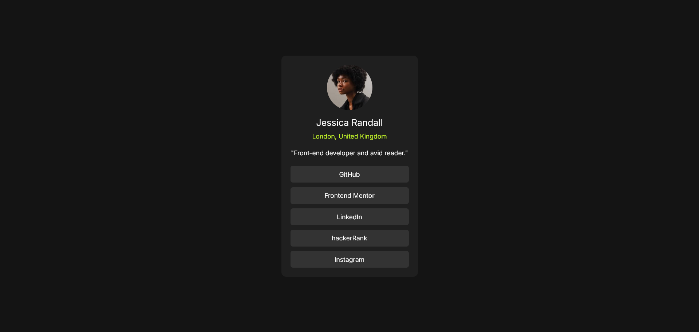

# Frontend Mentor - Social links profile solution

This is a solution to the [Social links profile challenge on Frontend Mentor](https://www.frontendmentor.io/challenges/social-links-profile-UG32l9m6dQ).

## Table of contents

- [Overview](#overview)
  - [The challenge](#the-challenge)
  - [Screenshot](#screenshot)
  - [Links](#links)
- [My process](#my-process)
  - [Built with](#built-with)
  - [Continued development](#continued-development)
- [Acknowledgments](#acknowledgments)

## Overview

### The challenge

Users should be able to:

- See hover and focus states for all interactive elements on the page.
- If the screen is a mobile phone, tablet or computer, this should not affect the user experience.

### Screenshot

### Links

- Solution URL: [social-links-profile](https://nmelissarp.github.io/social-links-profile/)

## My process

### Built with

- Semantic HTML5 markup
- CSS custom properties
- Flexbox
- Mobile-first workflow
- [Google Fonts] (https://fonts.google.com/specimen/Inter)

### Continued development

- Customize the template with my own social links profile.

## Acknowledgments

Just remember that with this type of one-dimensional projects, with vertically stacked elements (image, name, location, description and buttons) it is better to use Flexbox to give structure to the page.
